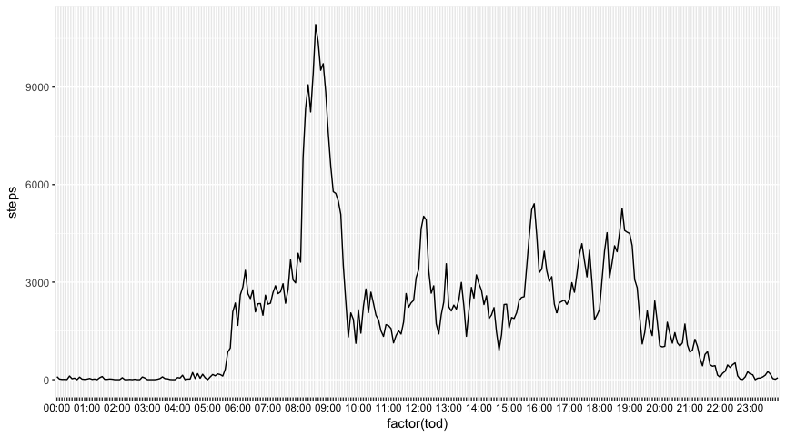
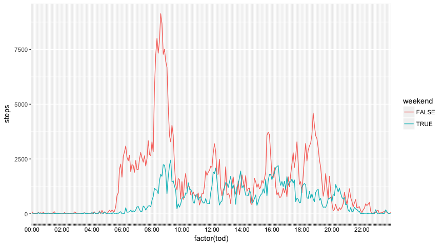
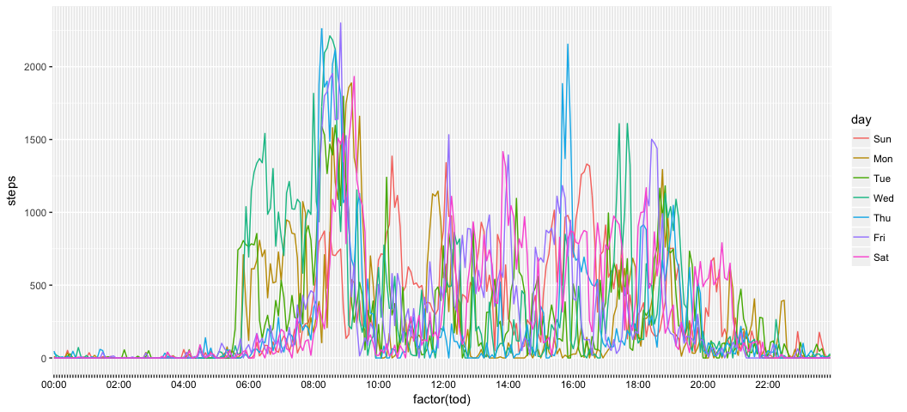

## Loading and preprocessing the data

Load the library and format the days and times for future graphs.

```r
suppressPackageStartupMessages(library(dplyr))
suppressPackageStartupMessages(library(ggplot2))
suppressPackageStartupMessages(library(lubridate))
if(file.exists("activity.zip")) {
        if(!file.exists("activity.csv")) {
                unzip("activity.zip")
        }
        activities <- as_tibble(read.csv("activity.csv")) %>% rowwise() %>% mutate (tod = convert(interval)) %>% mutate( day = lubridate::wday(date, label = TRUE)) %>% mutate(weekend = (day == "Sat" || day == "Sun") )
        summary(activities$steps)
}
```

```
##    Min. 1st Qu.  Median    Mean 3rd Qu.    Max.    NA's 
##    0.00    0.00    0.00   37.38   12.00  806.00    2304
```
Code that formats the date

```r
convert<- function(x){
        x = toString(x)
        while(nchar(x)<4) x <- paste0("0",x)
        chars <- strsplit(x,"")[[1]]
        x <- paste0(chars[1],chars[2],":",chars[3],chars[4])
}
```
The data has a lot of 0's and N/As, I wanted to check if the NA's were by day or within the day.  If a whole day has NAs then it will be 288, if its all data then there will be 0 NAs.  This code pulls out all the other days.  Since 0 rows all NAs are grouped by day.

```r
activities <- mutate(activities, missing = is.na(steps))
as_tibble(with(activities, table(date, missing))) %>% filter( n != 288 & n != 0)
```

```
## # A tibble: 0 x 3
## # ... with 3 variables: date <chr>, missing <chr>, n <int>
```
## What is mean total number of steps taken per day?
As you look at the summary, you can see there are a lot of zero's.
Zero is a valid step count for a 5 minute window, but unlikely for a day.

```r
daily <- activities %>% ungroup() %>% group_by(date) %>% summarise(daily = sum(steps, na.rm = TRUE)) %>% filter(daily!= 0)
qplot(daily$daily, bins = 30)
```

<!-- -->

```r
step_mean <- mean(daily$daily, na.rm = TRUE)
step_median <- median(daily$daily, na.rm = TRUE)
```
The mean daily step total is: 10766  
The median daily step total is: 10765  

## What is the average daily activity pattern?


```r
segment <- activities %>% ungroup() %>% group_by(tod) %>% summarise(steps = sum(steps, na.rm = TRUE))
#with(segment, plot(factor(tod), steps, type="l" ))
ggplot(data = segment, aes(x = factor(tod), y = steps, group = 1))+geom_line() +theme(axis.text.x=element_text(color=rep(c("black", rep("transparent", each =11)), 24)))
```

<!-- -->

```r
peak_interval = segment %>% filter(steps == max(steps)) %>% select(tod)
```
Peak interval is at 08:35

## Imputing missing values

```r
numberNAs <- sum(is.na(activities$steps))
```
Data has 2304.
Imputed data plan is to use the answer for that day of the week in that time interval.

```r
daily_means <- activities %>% ungroup() %>% group_by(interval, day) %>% summarize(mean_steps = mean(steps, na.rm = TRUE))
imputed_activities = left_join(activities, daily_means, by = c("day", "interval")) %>% mutate( steps = ifelse(is.na(steps), mean_steps, steps))
imputed_daily <- imputed_activities %>% ungroup() %>% group_by(date) %>% summarise(daily = sum(steps, na.rm = TRUE)) %>% filter(daily!= 0)
imputed_step_mean <- mean(imputed_daily$daily, na.rm = TRUE)
imputed_step_median <- median(imputed_daily$daily, na.rm = TRUE)
```
Mean changed from 10766 to 10821  
Median changed from 10765 to 11015  

## Are there differences in activity patterns between weekdays and weekends?

```r
segment <- activities %>% ungroup() %>% group_by(tod, weekend) %>% summarise(steps = sum(steps, na.rm = TRUE))

ggplot(data = segment, aes(x = factor(tod), y = steps, group = weekend))+geom_line( aes(color = weekend)) +theme(axis.text.x=element_text(color=rep(c("black", rep("transparent", each =23)), 12)))
```

<!-- -->
Clearly there is a lot more activity during the week than there is on the weekend.
Just for fun lets look how much variety there is in the individual days.

```r
segment <- activities %>% ungroup() %>% group_by(tod, day) %>% summarise(steps = sum(steps, na.rm = TRUE))

ggplot(data = segment, aes(x = factor(tod), y = steps, group = day))+geom_line(aes(color = day)) +theme(axis.text.x=element_text(color=rep(c("black", rep("transparent", each =23)), 12)))
```

<!-- -->
Thursday and Friday look more like a weekend in the AM than  Monday, Tuesday, Wednesday.  
